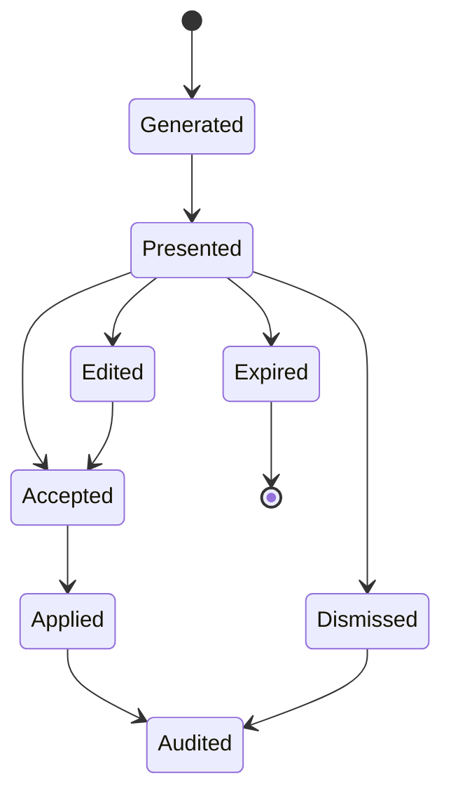

# BetterHarvest AI Feature Design

## 1. AI Product Principles

- AI proposes; users approve.
- Every suggestion must show evidence and confidence.
- AI cannot silently create, approve, invoice, delete, or send financially meaningful records.
- AI features must reduce admin or improve accuracy; no gimmick surfaces.
- Prompt payloads must be minimal, permission-scoped, and auditable.

## 2. AI Capabilities

### 2.1 Time Entry Suggestions

Inputs:

- Calendar events.
- Git commits and pull requests.
- Jira/Azure DevOps/GitHub issue activity.
- Existing project/task history.
- Optional future activity timeline.

Output:

- Suggested project, task, date, duration, note, billable flag.
- Evidence list.
- Confidence score.
- Explanation.

User actions: accept, edit, dismiss, snooze, never suggest again for source pattern.

### 2.2 Missing Or Suspicious Time Detection

Signals:

- Workday with no entries.
- Calendar meetings without time entries.
- Long entries above organization policy.
- Overlapping entries.
- Entries on archived projects.
- Repeated vague notes.

Output:

- Alert severity.
- Fix action.
- Explanation.

### 2.3 Weekly Timesheet Summary

Generates internal or client-ready summary from submitted or approved time. Must include source links and allow user edits before sharing.

### 2.4 Client Progress Reports

Creates narrative report sections:

- Work completed.
- Time by project/task.
- Budget status.
- Risks/blockers.
- Next steps.

### 2.5 Budget Burn Explanation

Answers why project burn changed using rates, roles, tasks, non-billable work, scope mix, and historical comparison.

### 2.6 Estimate Improvement Suggestions

Compares actuals vs estimates by task type, role, client, and project pattern. Produces suggested estimate adjustments with confidence and caveats.

### 2.7 Capacity Risk Summary

Summarizes over-allocation, under-utilization, upcoming conflicts, and skills/role bottlenecks.

### 2.8 Invoice Draft Support

Drafts invoice descriptions from approved time and expense records. Cannot send invoice without finance user confirmation.

### 2.9 Natural-Language Report Builder

Translates user question into report filters and grouping, shows the generated query parameters, then runs a permission-scoped report.

### 2.10 Assistant Chat

Answers questions such as "How much time did we spend on Client X last month?" using read-only query tools and source-linked responses.

## 3. AI Suggestion Lifecycle

## 4. Data Controls

- Organization-level AI enablement.
- Per-integration consent.
- Per-user suggestion controls.
- Data retention window for evidence.
- Redaction of sensitive notes where possible.
- Provider metadata stored with every suggestion.
- Prompt and completion retention configurable.

## 5. Evaluation

- Suggestion acceptance rate.
- Edit distance after accepting.
- Dismissal reasons.
- Time saved in weekly submission.
- False-positive rate for suspicious time.
- User trust score from feedback.
- AI cost per active user.

## 6. AI Risks

- Hallucinated report answers.
- Incorrect time attribution.
- Sensitive client data leakage.
- Over-automation of financial records.
- Biased productivity judgments.

Mitigations:

- Source-linked answers only.
- Use deterministic reporting queries for numbers.
- Human review before record mutation.
- Explicit audit records.
- No productivity scoring of individuals in MVP.
