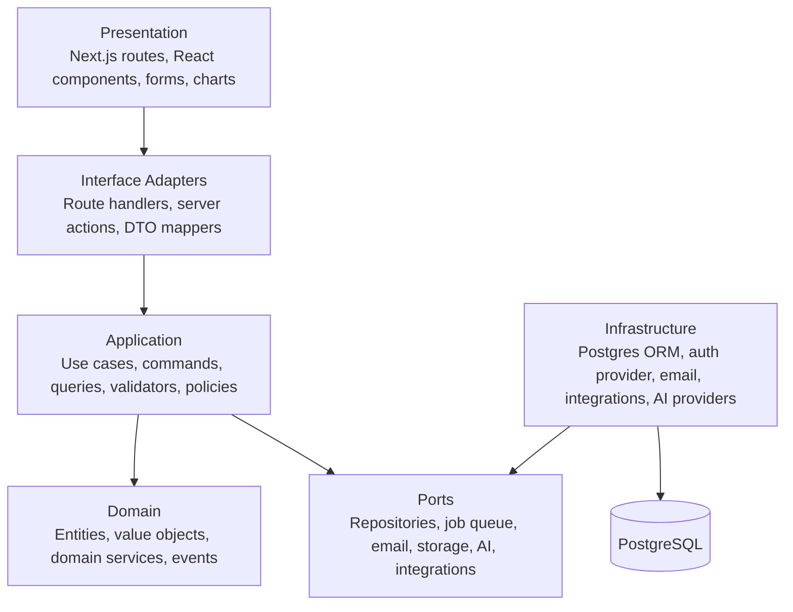
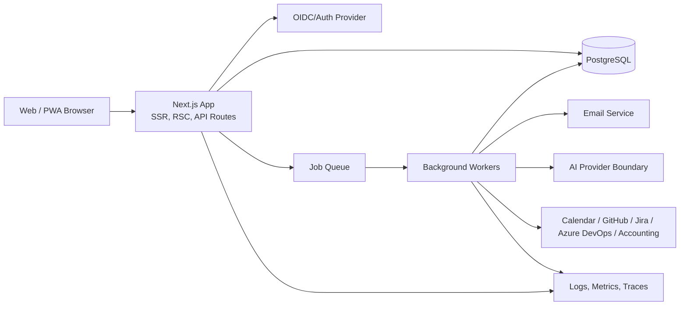
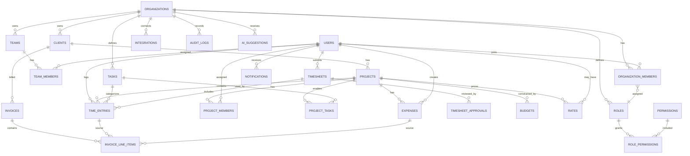

# BetterHarvest Architecture

## 1. Architecture Decision Summary

Use a full-stack Next.js App Router application with TypeScript, PostgreSQL, clean architecture module boundaries, server-side use cases, background workers, and Azure-ready deployment. The architecture keeps product logic out of React components and route handlers so a separate backend can be extracted later if needed.

Primary stack assumption:

- Next.js App Router.
- TypeScript.
- PostgreSQL.
- Prisma or Drizzle ORM. Recommendation: Prisma for MVP velocity unless SQL-heavy reporting pushes Drizzle.
- Auth.js or OIDC-ready auth provider. Recommendation: Auth.js for open implementation or Clerk/Azure AD B2C for faster enterprise auth.
- Zod for DTO validation.
- TanStack Query for client-side server state where client interactivity needs caching.
- Tailwind CSS plus a mature component foundation such as shadcn/ui.
- Background jobs with pg-boss, Trigger.dev, or Azure Container Apps jobs. Recommendation: pg-boss for Postgres-native MVP.
- Docker and Azure Container Apps or Azure App Service with Azure Database for PostgreSQL.

## 2. Clean Architecture Boundaries



Rules:

- Presentation imports application DTOs and invokes server actions/API clients, not repositories.
- Application imports domain and ports, not Next.js runtime.
- Domain has no framework imports.
- Infrastructure implements ports and owns ORM/provider details.
- Tenant authorization is enforced in application use cases and repository scopes.

## 3. Suggested Folder Structure

```text
betterharvest/
  src/
    app/
      (auth)/
      (app)/
      api/
    components/
      ui/
      app-shell/
      time/
      reports/
      approvals/
    features/
      time/
        presentation/
        application/
        domain/
        data/
      timesheets/
      projects/
      clients/
      reports/
      invoices/
      ai/
      admin/
    server/
      auth/
      db/
      jobs/
      observability/
      permissions/
    shared/
      application/
      domain/
      validation/
      utils/
  prisma/
    schema.prisma
    migrations/
    seed.ts
  tests/
    unit/
    integration/
    e2e/
  docs/
  docker/
  .github/workflows/
```

## 4. Runtime Architecture



## 5. Multi-Tenant Strategy

- Every tenant-owned table includes `organization_id`.
- Application use cases require `actor`, `organizationId`, and permission context.
- Repository methods require organization scope; unscoped queries are prohibited except platform admin paths.
- Unique indexes include `organization_id` where names/slugs only need tenant-level uniqueness.
- Soft delete uses `deleted_at`, `deleted_by`, and filtered unique indexes where needed.
- Audit logs append immutable events for sensitive actions.

## 6. Authentication And Authorization

Auth:

- OIDC-ready sessions with JWT/session cookie.
- Organization membership selected after sign-in.
- Optional SSO/SAML deferred to later enterprise package.

Roles:

- Owner: all permissions and billing/security ownership.
- Admin: organization configuration and user management.
- Manager: projects, teams, approvals, reports for assigned scope.
- Member: own time, expenses, timesheets, project visibility.
- Finance: invoices, rates, expenses, billing reports.
- Client Viewer: client-facing reports/invoices only, deferred unless needed.

Permission examples:

- `time.entry.write.own`
- `timesheet.submit.own`
- `timesheet.approve.team`
- `project.manage`
- `client.manage`
- `rate.view`
- `invoice.manage`
- `report.view.financial`
- `admin.manage_org`

## 7. Background Jobs

- Timesheet reminder generation.
- Missing time scans.
- Budget burn recalculation.
- Report exports.
- Invoice PDF generation.
- Integration sync.
- AI suggestion generation.
- Notification delivery.
- Audit compaction/read-model updates.

## 8. Observability

- Structured logs with request ID, organization ID, actor ID, use case name.
- Metrics for latency, errors, queue depth, DB query duration, AI cost, integration failures.
- Traces across route handler, use case, repository, external provider.
- Audit logs are product records, not merely observability logs.

## 9. Database ERD



## 10. Core Tables

All tenant-owned tables include `id uuid primary key`, `organization_id uuid`, `created_at`, `created_by`, `updated_at`, `updated_by`, `deleted_at`, `deleted_by` unless noted.

- `users`: global identity, email, name, avatar, locale.
- `organizations`: name, slug, timezone, currency, week_start, settings.
- `organization_members`: organization_id, user_id, role_id, status.
- `teams`, `team_members`.
- `roles`, `permissions`, `role_permissions`.
- `clients`: name, billing_email, status, notes.
- `projects`: client_id, name, code, status, billable, budget_id, default_rate_id.
- `project_members`: project_id, user_id, role, billable_rate_override, cost_rate_override.
- `tasks`: name, billable_default, archived_at.
- `project_tasks`: project_id, task_id.
- `time_entries`: user_id, project_id, task_id, timesheet_id, date, start_at, end_at, duration_minutes, billable, notes, status, source, timer_state.
- `timesheets`: user_id, period_start, period_end, status, submitted_at, approved_at.
- `timesheet_approvals`: timesheet_id, approver_id, decision, comment.
- `expenses`: user_id, project_id, category, amount, currency, receipt_url, status.
- `budgets`: project_id/client_id, type, amount, period, threshold_percent.
- `rates`: scope_type, scope_id, rate_type, amount, currency, effective_from, effective_to.
- `invoices`: client_id, number, status, issue_date, due_date, subtotal, tax_total, total.
- `invoice_line_items`: invoice_id, source_type, source_id, description, quantity, unit_amount, total.
- `tags`, `time_entry_tags`.
- `integrations`: provider, status, encrypted_tokens_ref, scopes, last_sync_at.
- `audit_logs`: actor_id, entity_type, entity_id, action, before_json, after_json, reason, ip_hash.
- `ai_suggestions`: user_id, suggestion_type, status, confidence, evidence_json, proposed_json, explanation, expires_at.
- `notifications`: user_id, type, payload_json, read_at.

## 11. Index Strategy

- `time_entries (organization_id, user_id, date)`.
- `time_entries (organization_id, project_id, date)`.
- `time_entries (organization_id, timesheet_id)`.
- `timesheets (organization_id, user_id, period_start, period_end)` unique.
- `projects (organization_id, client_id, status)`.
- `clients (organization_id, name)`.
- `audit_logs (organization_id, entity_type, entity_id, created_at)`.
- `ai_suggestions (organization_id, user_id, status, created_at)`.
- `invoices (organization_id, client_id, status, issue_date)`.

## 12. AI Service Boundary

AI providers never receive raw tenant data by default. Application services prepare minimal, purpose-specific prompts with redaction where possible. AI outputs are stored as suggestions or generated drafts, not canonical records. Every AI suggestion includes source evidence, model/provider metadata, confidence, explanation, user action, and audit trail.

## 13. Deployment Strategy

- Local: Docker Compose for Postgres, app, worker; optional Aspire-like orchestration can be revisited if .NET services are introduced.
- CI: GitHub Actions for lint, typecheck, unit tests, integration tests, Playwright E2E, build, image scan.
- Environments: preview, staging, production.
- Azure: Azure Container Apps or App Service, Azure Database for PostgreSQL, Key Vault, Application Insights, Container Registry.

## 14. Architecture Open Questions

1. Prisma vs Drizzle.
2. Auth.js vs managed auth.
3. Single Next.js runtime workers vs separate worker process.
4. Whether reporting needs OLAP/read-model tables in V1.
5. Whether .NET 10 backend remains a future split option.
