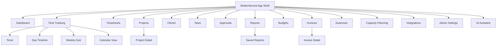
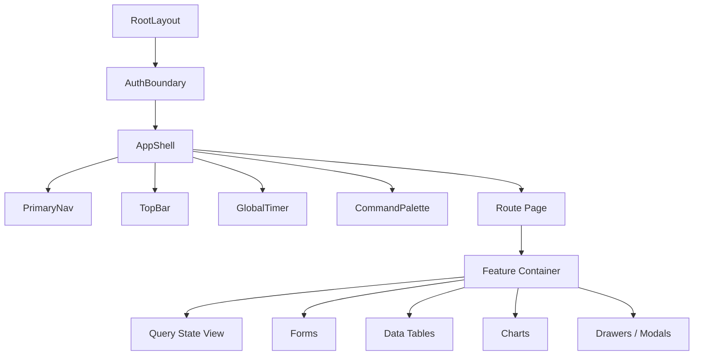

# BetterHarvest UX Design Specification

## 1. UX Strategy

BetterHarvest should feel like an operational cockpit, not a marketing site. The primary experience is the signed-in product: dense enough for repeated work, calm enough for financial review, and fast enough that time tracking does not become a separate job.

Design priorities:

- Fast weekly time entry.
- Always-visible timer access.
- Reports that explain project health without requiring spreadsheet exports.
- Keyboard-first flows for power users.
- Mobile-friendly entry and approval.
- Clear distinction between actual records, draft records, and AI suggestions.

## 2. Information Architecture

## 3. Page List

- `/app` — personal dashboard.
- `/app/time` — day timeline and active timer.
- `/app/time/week` — weekly timesheet grid.
- `/app/time/calendar` — calendar-based time entry.
- `/app/timesheets` — personal timesheet history.
- `/app/approvals` — manager approval queue.
- `/app/clients` and `/app/clients/[clientId]`.
- `/app/projects` and `/app/projects/[projectId]`.
- `/app/tasks` — task catalog.
- `/app/team` and `/app/team/[userId]`.
- `/app/reports` and `/app/reports/[reportId]`.
- `/app/budgets`.
- `/app/invoices` and `/app/invoices/[invoiceId]`.
- `/app/expenses`.
- `/app/capacity`.
- `/app/integrations`.
- `/app/assistant`.
- `/app/settings`.
- `/auth/sign-in`, `/auth/sign-up`, `/auth/callback`.

## 4. Core Layout

- **App shell:** left navigation on desktop, bottom navigation on mobile for Dashboard, Time, Timesheets, Reports, More.
- **Top bar:** organization switcher, global timer, command palette trigger, search, notifications, profile.
- **Global timer:** compact persistent control with project/task, elapsed time, start/stop, note shortcut.
- **Command palette:** create time entry, start timer, jump to project/client/report, ask AI, submit timesheet.
- **Theme:** light/dark mode from day one; system preference default.

## 5. Component Hierarchy

## 6. Reusable UI Components

- `Button`, `IconButton`, `Tooltip`, `DropdownMenu`, `CommandMenu`.
- `DataTable`, `FilterBar`, `DateRangePicker`, `SavedViewSelector`.
- `MetricCard`, `TrendBadge`, `ProgressBar`, `BudgetBurnChart`, `UtilizationChart`.
- `TimerControl`, `TimeEntryEditor`, `WeeklyGrid`, `CalendarTimeBlock`.
- `ApprovalQueue`, `ApprovalDecisionPanel`, `AuditTimeline`.
- `ProjectPicker`, `ClientPicker`, `TaskPicker`, `UserPicker`, `TagPicker`.
- `SuggestionCard`, `EvidenceList`, `ConfidenceIndicator`, `AssistantPanel`.

## 7. Key Workflows

### 7.1 One-Click Timer

Entry points: global timer, favorite row, recent entry, command palette, project detail.

States:

- Idle: project/task empty or preselected.
- Running: elapsed time, project/task, pause/stop/edit.
- Stopped: save confirmation if required fields are valid.
- Conflict: another timer already running.

### 7.2 Weekly Timesheet Grid

Requirements:

- Rows are project/task combinations.
- Columns are weekdays plus row totals.
- Keyboard entry supports tab/arrow navigation.
- Inline validation marks missing project/task, locked periods, overlapping entries, and policy violations.
- Suggestions appear as ghost values requiring explicit accept/edit/dismiss.
- Sticky footer shows daily totals, weekly total, billable total, and submit status.

### 7.3 Approval Queue

Managers need quick scanning:

- Queue grouped by week/team/user.
- Bulk approve clean rows.
- Warning chips for missing time, overtime, overlap, budget risk, suspicious edits.
- Decision drawer shows timesheet detail, comments, audit, and return reason.

### 7.4 Reports

Report builder:

- Filter by date, client, project, task, user, team, tag, billability, approval status.
- Group by client/project/task/user/week/month.
- Save report views.
- Export CSV/PDF.
- Natural-language report builder in V2 must show generated filters before running.

## 8. Dashboard Widgets

- Active timer.
- This week progress.
- Missing time alerts.
- Submitted/approved status.
- Favorite projects/tasks.
- Recent reports.
- Team approval queue.
- Budget burn warnings.
- Profitability snapshot.
- Capacity risk preview.
- AI suggestions requiring review.

## 9. Design System Tokens

Use restrained operational styling, not a one-color brand wash.

- Background: neutral canvas with subtle surface contrast.
- Primary action: deep teal or blue-green.
- Accent: amber for warnings, red for destructive/risk, green for success, violet only for AI accents.
- Radius: 6-8px for controls and cards.
- Typography: system sans, normal letter spacing, compact headings in app surfaces.
- Density: default compact with comfortable touch targets on mobile.
- Charts: multi-hue palette optimized for color-blind readability.

## 10. Accessibility Rules

- Target WCAG 2.2 AA.
- All controls keyboard reachable.
- Visible focus rings.
- No color-only state communication.
- Timer and timesheet updates announced politely to assistive tech only when meaningful.
- Charts provide data tables or summaries.
- Command palette supports screen-reader labels and escape behavior.

## 11. Responsive Rules

- Mobile prioritizes timer, today, weekly status, submit, and approvals.
- Tables collapse into cards only where scanning remains practical.
- Weekly grid uses horizontal scroll with sticky labels on narrow viewports.
- Calendar view has day/agenda mode on mobile.
- Avoid hover-only interactions.

## 12. UX Open Questions

1. Should the global timer be allowed without selecting a project/task, or require selection before start?
2. Should individual contributors see profitability signals, or only managers/admins?
3. Should client-viewer role exist in MVP or V1?
4. Should AI assistant live as a standalone page, side panel, or command palette mode?
